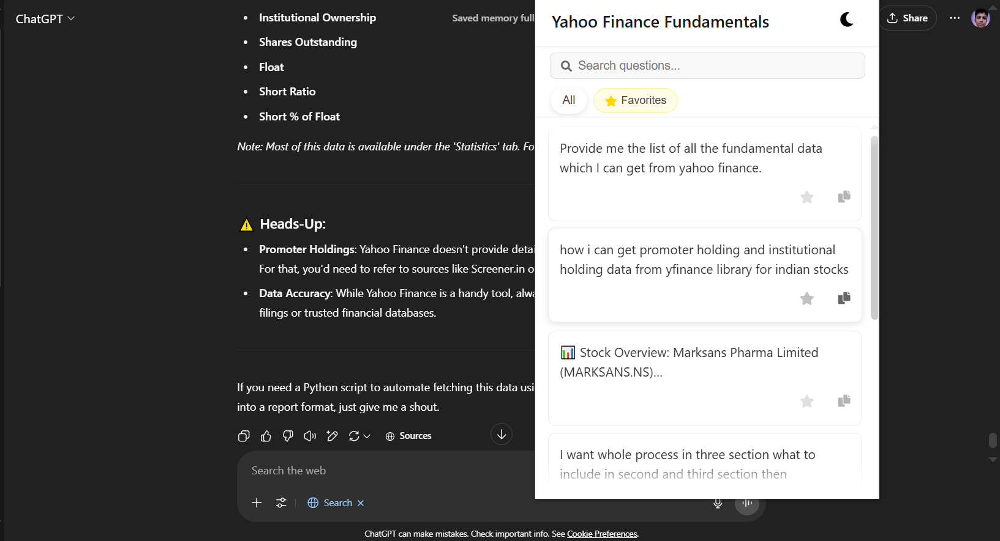

# Scroll AI - AI Chat Navigator Chrome Extension




Scroll AI is a Chrome extension designed to enhance your experience with AI chat platforms like ChatGPT, Deepseek, and other similar services. It helps you keep track of the questions you've asked during a conversation, allowing you to quickly navigate back to specific points in your chat history.

## Features

*   **Automatic Question Tracking**: Scroll AI automatically detects and lists questions you ask in supported AI chat interfaces.
*   **Quick Navigation**: Simply click on a question in the extension popup to instantly scroll the chat page to that specific question and its answer.
*   **Search Functionality**: Easily find specific questions within the current chat using the built-in search bar.
*   **Favorites**: Mark important or frequently referenced questions as "Favorites" for quick access.
*   **Light & Dark Mode**: Adapts to your preferred theme for comfortable viewing.
*   **Supports Multiple Chat Platforms**: Designed to work with popular AI chat services.

## Use Case

Have you ever been deep in a long conversation with an AI, asking multiple questions, and then wished you could quickly jump back to an earlier point without endless scrolling? Scroll AI solves this problem.

It acts as a dynamic table of contents for your AI chats. Whether you're researching, brainstorming, or debugging, Scroll AI helps you efficiently revisit previous parts of your conversation, saving you time and effort.

## Installation from GitHub

To install Scroll AI from this GitHub repository, follow these steps:

1.  **Download the Extension Files:**
    *   **Option 1 (Download ZIP):**
        *   Click on the "Code" button on the GitHub repository page.
        *   Select "Download ZIP".
        *   Once downloaded, unzip the file to a memorable location on your computer (e.g., `C:\Users\YourUser\Documents\ScrollAI-Extension`).
    *   **Option 2 (Git Clone):**
        *   If you have Git installed, you can clone the repository using the command:
            ```bash
            git clone <repository_url>
            ```
        *   Replace `<repository_url>` with the actual URL of your GitHub repository.

2.  **Load the Extension in Chrome:**
    *   Open Google Chrome.
    *   Navigate to the extensions page by typing `chrome://extensions` in the address bar and pressing Enter.
    *   **Enable Developer Mode**: In the top right corner of the extensions page, toggle the "Developer mode" switch to the "on" position.
    *   **Load Unpacked Extension**:
        *   Click on the "Load unpacked" button that appears after enabling Developer mode.
        *   A file dialog will open. Navigate to the directory where you unzipped or cloned the extension files (e.g., the `ScrollAI-Extension` folder you created, which should contain the `manifest.json` file).
        *   Select this directory.
    *   The Scroll AI extension should now appear in your list of installed extensions and be ready to use! You'll see its icon in the Chrome toolbar.

## How to Use

1.  Navigate to a supported AI chat website (e.g., ChatGPT, Deepseek).
2.  Start a conversation with the AI.
3.  Click on the Scroll AI extension icon in your Chrome toolbar to open the popup.
4.  As you ask questions, they will appear in the popup list.
5.  Click on any question in the list to scroll the main chat page to that question.
6.  Use the search bar to filter questions or click the "Favorites" tab to see your marked questions.

---

Enjoy a more organized and navigable AI chat experience with Scroll AI!
